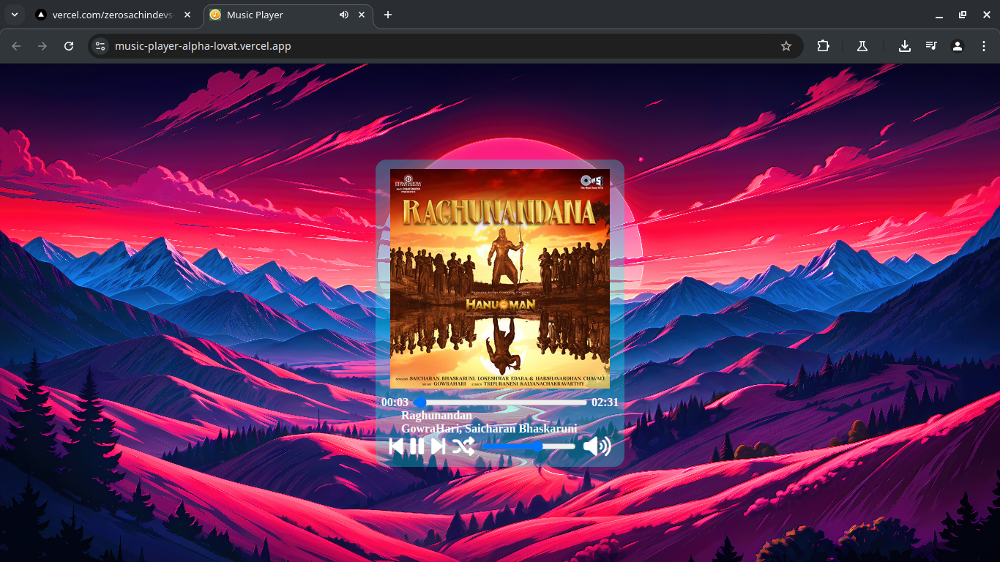

## 🚀 Features

- Play, pause, forward, and backward controls
- Random (shuffle) playback
- Volume control and mute toggle
- Track progress bar with current and total duration display
- Responsive and visually styled UI with background

## 🛠 Technologies Used

- HTML5
- CSS3 
- JavaScript (DOM Manipulation, Audio API)

## 📸 Screenshot & 🖼 UI Preview
[Click here to Live Preview](https://music-player-alpha-lovat.vercel.app/)

